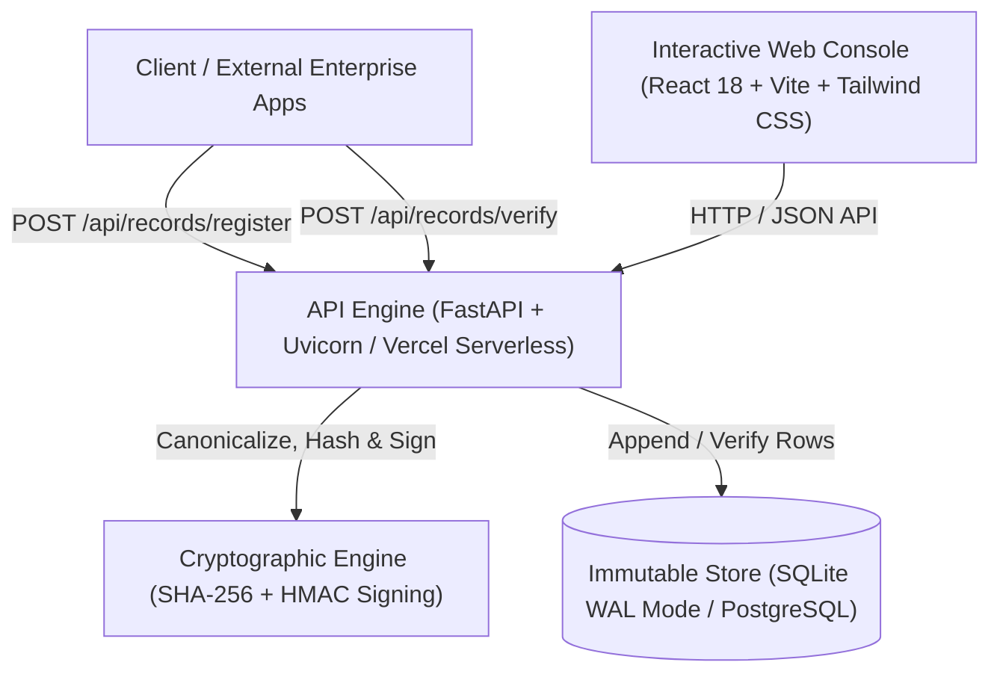

# HashLog

> **Versioned External Integrity Ledger & Cryptographic Audit Trail**

HashLog is an append-only cryptographic ledger that stores versioned raw log snapshots alongside their hashes, allowing both tamper detection and visual change inspection.

By combining canonical content hashing with dual-lineage SHA-256 hash chains, HMAC-signed audit certificates, and independent state checkpoints, HashLog exposes unauthorized database edits and shows what changed between stored log versions.

---

## Table of Contents

1. [Core Concepts & Dual-Lineage Architecture](#core-concepts--dual-lineage-architecture)
2. [The Problem: Vulnerabilities in Traditional Auditing](#the-problem-vulnerabilities-in-traditional-auditing)
3. [Architectural Comparison](#architectural-comparison)
4. [Mathematical & Cryptographic Specification](#mathematical--cryptographic-specification)
5. [System Architecture & Tech Stack](#system-architecture--tech-stack)
6. [API Endpoints Reference](#api-endpoints-reference)
7. [Database Schema](#database-schema)
8. [Getting Started (Step-by-Step Setup)](#getting-started-step-by-step-setup)
   - [Backend Setup (FastAPI)](#1-backend-setup-python--fastapi)
   - [Frontend Setup (React + Vite)](#2-frontend-setup-react--vite)
   - [Running Verification & Test Suite](#3-running-verification--test-suite)
9. [Deployment Guide (Vercel Serverless)](#deployment-guide-vercel-serverless)
10. [Tamper Detection Demonstration](#tamper-detection-demonstration)
11. [Configuration & Environment Variables](#configuration--environment-variables)
12. [Enterprise Compliance & Use Cases](#enterprise-compliance--use-cases)
13. [Repository Structure](#repository-structure)

---

## Core Concepts & Dual-Lineage Architecture

Unlike conventional logging engines that duplicate mutable application data into another table, HashLog operates strictly on cryptographic proofs:

1. **Versioned Content Ingestion**: The application stores a raw snapshot for each version and calculates its canonical `content_hash`, allowing auditors to inspect the original and changed content.
2. **Dual-Lineage Cryptographic Graph**:
   - **Global Ledger Spine (`previous_ledger_hash`)**: Every record is linked linearly to the preceding ledger entry across all systems, forming an append-only timeline starting from `GENESIS`.
   - **Per-Record Version Chain (`previous_version_hash`)**: Entries sharing the same composite identity (`source_system`, `record_type`, `record_id`) maintain an independent version lineage ($v1 \rightarrow v2 \rightarrow v3$).
3. **Cryptographically Signed Audit Certificates**: Generates HMAC-SHA256 signed evidence certificates (`HASHLOG_AUDIT_CERTIFICATE_V1`) for external verification and auditing.
4. **Independent Checkpoint Anchoring**: Periodically freezes ledger root hashes into point-in-time snapshot anchors (`HASHLOG_CHECKPOINT_ANCHOR_V1`) for off-chain or decentralized verification.

```
GLOBAL LEDGER SPINE:
[ GENESIS ] ───> [ Block #1: Invoice v1 ] ───> [ Block #2: Order v1 ] ───> [ Block #3: Invoice v2 ]
                         │                                                        ▲
                         └─────────────── previous_version_hash ──────────────────┘
                                      (PER-RECORD LINEAGE DAG)
```

---

## The Problem: Vulnerabilities in Traditional Auditing

In standard relational and document databases (PostgreSQL, MySQL, SQLite, MongoDB), audit logs are stored as regular mutable table rows.

```text
[ Mutable Database Rows ]
Row 1: Admin created user account
Row 2: User transferred $5,000.00  <── Attacker or rogue DBA alters to $50.00
Row 3: User logged out
```

### The Security Gap
1. **Silent In-Place Modification**: Any user, compromised service account, or rogue database administrator with `UPDATE` or `DELETE` permissions can alter historical records without leaving a trace:
   ```sql
   UPDATE transactions SET amount = 50.00 WHERE id = 2;
   ```
2. **No Intrinsic Proof**: Standard relational databases cannot prove whether a historical query result reflects the exact data state written at creation time.
3. **Compromised Log Files**: Centralized text log streams (e.g. syslog, logstash) can be truncated or modified by root attackers after an intrusion.

---

## Architectural Comparison

| Dimension | Traditional Database | Public Blockchain | HashLog |
| :--- | :--- | :--- | :--- |
| **Tamper Evidence** | None (silently mutable) | High (consensus-backed) | **Instant & Mathematically Verifiable** |
| **Data Privacy** | Raw data stored | Public or expensive ZK | **Zero-Knowledge (Hashes Only)** |
| **Write Latency** | $< 5\text{ ms}$ | $2\text{ s} - 15\text{ min}$ | **$< 2\text{ ms}$** |
| **Cost & Gas Fees** | Low | High per transaction | **Zero gas / standard infrastructure** |
| **Storage Footprint** | Large (full payloads) | Very Large | **Minimal (32-byte hashes + metadata)** |
| **Deployment Model** | Relational / NoSQL | Distributed Node Network | **Lightweight Microservice / Vercel Serverless** |

---

## Mathematical & Cryptographic Specification

### 1. Canonical Deterministic Serialization

To avoid hash discrepancies caused by non-deterministic key ordering or whitespace differences, all payloads undergo strict canonicalization prior to hashing:

```text
canonicalize(X) = JSON(ensure_ascii=False, sort_keys=True, separators=(",", ":"))
```

### 2. Content Hash Computation

Given an external record payload `C`:

```text
content_hash = SHA-256(canonicalize(C))
```

### 3. Entry Hash Computation

Each ledger block binds together both lineages, metadata, and timestamps into a unified proof:

```text
payload = canonicalize({
    previous_version_hash,
    previous_ledger_hash,
    source_system,
    record_type,
    record_id,
    version_number,
    content_hash,
    timestamp
})

entry_hash = SHA-256(payload)
```

- For the genesis entry: `previous_ledger_hash = "GENESIS"`.
- For version 1 of any record identity: `previous_version_hash = None`.

### 4. HMAC-SHA256 Cryptographic Signatures

Audit certificates and downloadable checkpoint anchors are signed with HMAC-SHA256 using the configured `HASHLOG_SIGNING_SECRET`:

```text
signature = HMAC-SHA256(secret, canonicalize(payload))
```

### 5. Full Ledger Verification Algorithm

Verification performs a linear single-pass audit across the entire chain:

```text
expected_ledger_hash = "GENESIS"
latest_version_by_identity = {}

for each record in ledger (ordered by id ASC):
    identity = (record.source_system, record.record_type, record.record_id)
    prev_record = latest_version_by_identity.get(identity)
    
    # 1. Validate global chain linkage
    if record.previous_ledger_hash != expected_ledger_hash:
        return FAIL(tampered_at=record.id, reason="Broken global ledger link")
        
    # 2. Validate per-record version continuity
    expected_version = (prev_record.version_number + 1) if prev_record else 1
    expected_prev_version_hash = prev_record.entry_hash if prev_record else None
    
    if record.version_number != expected_version or record.previous_version_hash != expected_prev_version_hash:
        return FAIL(tampered_at=record.id, reason="Broken record version continuity")
        
    # 3. Recalculate and match cryptographic hash
    recalculated_entry_hash = compute_entry_hash(record)
    if record.entry_hash != recalculated_entry_hash:
        return FAIL(tampered_at=record.id, reason="Cryptographic signature mismatch")
        
    expected_ledger_hash = recalculated_entry_hash
    latest_version_by_identity[identity] = record

return PASS(valid=True, total_records=count)
```

---

## System Architecture & Tech Stack



### Core Technologies
- **Backend Service**: Python 3.10+, FastAPI (ASGI), Uvicorn, Pydantic v2, Serverless support via `api/index.py`.
- **Data Persistence**: SQLite with Write-Ahead Logging (`PRAGMA journal_mode = WAL`) and row busy timeout safeguards; clean architecture ready for PostgreSQL.
- **Frontend Studio**: React 18, Vite, Tailwind CSS, React Icons, Axios.
- **Design System**: Luxury Veluna-inspired dark obsidian theme (`#000000`), subtle fractal noise overlay, warm copper accents (`#c9793f`), and Fraunces serif typography.
- **Continuous Integration / Verification**: `run_all.sh` shell test runner for cross-platform validation.

---

## API Endpoints Reference

Interactive OpenAPI documentation is automatically served at `http://localhost:8000/docs`.

### 1. Record Ingestion & History

#### `POST /api/records/register`
Hashes one external record in memory and commits its proof to the ledger.
- **Request Body**:
  ```json
  {
    "source_system": "billing-service",
    "record_type": "invoice",
    "record_id": "INV-2026-001",
    "content": {
      "customer_id": "CUST-882",
      "amount": 4500.00,
      "currency": "USD",
      "status": "APPROVED"
    },
    "metadata": { "region": "us-east-1", "operator": "auto-runner" }
  }
  ```
- **Response** (`201 Created`):
  ```json
  {
    "id": 1,
    "source_system": "billing-service",
    "record_type": "invoice",
    "record_id": "INV-2026-001",
    "version_number": 1,
    "content_hash": "a4f8e3...",
    "entry_hash": "3b3350...",
    "previous_version_hash": null,
    "previous_ledger_hash": "GENESIS",
    "timestamp": 1787402000000,
    "metadata": { "region": "us-east-1", "operator": "auto-runner" },
    "created_at": "2026-08-22T12:00:00"
  }
  ```

#### `POST /api/records/import`
Batch ingestion endpoint for committing multiple records in an atomic transaction.
- **Request Body**:
  ```json
  {
    "source_system": "inventory-db",
    "record_type": "stock-level",
    "records": [
      { "record_id": "SKU-100", "content": { "qty": 450 } },
      { "record_id": "SKU-101", "content": { "qty": 120 } }
    ]
  }
  ```

#### `GET /api/records`
Lists persisted proofs with optional filtering by `source_system` or `record_type`.

#### `GET /api/records/history`
Fetches the complete immutable version lineage ($v1 \rightarrow v2 \rightarrow v3$) for a specific record identity (`source_system`, `record_type`, `record_id`).

---

### 2. Forensic Auditing & Verification

#### `POST /api/records/verify`
Validates whether live external record content matches the latest trusted on-chain proof.
- **Request Body**:
  ```json
  {
    "source_system": "billing-service",
    "record_type": "invoice",
    "record_id": "INV-2026-001",
    "content": { "customer_id": "CUST-882", "amount": 4500.00, "currency": "USD", "status": "APPROVED" }
  }
  ```
- **Response** (`200 OK`):
  ```json
  {
    "valid": true,
    "source_system": "billing-service",
    "record_type": "invoice",
    "record_id": "INV-2026-001",
    "latest_version": 1,
    "expected_hash": "a4f8e3...",
    "actual_hash": "a4f8e3...",
    "message": "External record matches the latest registered version"
  }
  ```

#### `GET /api/ledger/verify`
Traverses and cryptographically recomputes the entire global ledger and every version sub-chain from Genesis to tip.

---

### 3. Checkpoints & Signed Cryptographic Artifacts

| Method | Endpoint | Description |
| :--- | :--- | :--- |
| `POST` | `/api/checkpoints` | Create a snapshot anchor of the current ledger root hash |
| `GET` | `/api/checkpoints` | List all historical checkpoint anchors |
| `GET` | `/api/checkpoints/{id}/verify` | Cryptographically verify all records covered by a specific checkpoint |
| `GET` | `/api/checkpoints/{id}/anchor` | Download a signed HMAC-SHA256 checkpoint anchor (`HASHLOG_CHECKPOINT_ANCHOR_V1`) |
| `GET` | `/api/audit/certificate` | Generate a signed HMAC-SHA256 ledger audit certificate (`HASHLOG_AUDIT_CERTIFICATE_V1`) |
| `GET` | `/api/export` | Export all ledger proofs as a chronological JSON array |
| `GET` | `/api/health` | Service health status and total proof count |

---

### 4. Development-Only Tamper Simulation APIs

*(Available only when `HASHLOG_ENABLE_TAMPER_TEST=true` is set)*

| Method | Endpoint | Description |
| :--- | :--- | :--- |
| `POST` | `/api/dev/tamper` | Intentionally corrupt a stored hash proof to demonstrate live audit failure |
| `POST` | `/api/dev/tamper/revert` | Restore the original backed-up hash proof to return the chain to valid state |

---

### 5. Bot Protection

#### `POST /api/captcha/verify`
Server-side verification of a Cloudflare Turnstile token (`TURNSTILE_SECRET_KEY`), used to gate access before write operations. Not documented via the interactive OpenAPI schema view.

---

## Database Schema

HashLog manages two append-only relational tables in SQLite (`backend/hashlog.db`):

```sql
-- Proof Ledger Table
CREATE TABLE IF NOT EXISTS hash_records (
    id                    INTEGER PRIMARY KEY AUTOINCREMENT,
    source_system         TEXT NOT NULL,
    record_type           TEXT NOT NULL,
    record_id             TEXT NOT NULL,
    version_number        INTEGER NOT NULL,
    content_hash          TEXT NOT NULL,
    entry_hash            TEXT NOT NULL,
    previous_version_hash TEXT,
    previous_ledger_hash  TEXT NOT NULL,
    timestamp             INTEGER NOT NULL,
    metadata              TEXT,
    created_at            TEXT NOT NULL DEFAULT CURRENT_TIMESTAMP,
    UNIQUE(source_system, record_type, record_id, version_number)
);

-- State Snapshot Anchors Table
CREATE TABLE IF NOT EXISTS checkpoints (
    id                    INTEGER PRIMARY KEY AUTOINCREMENT,
    last_record_id        INTEGER NOT NULL,
    ledger_hash           TEXT NOT NULL,
    created_at            TEXT NOT NULL DEFAULT CURRENT_TIMESTAMP
);

-- Performance & Lineage Indexes
CREATE INDEX IF NOT EXISTS idx_hash_records_identity 
    ON hash_records(source_system, record_type, record_id, version_number);
CREATE INDEX IF NOT EXISTS idx_hash_records_content_hash 
    ON hash_records(content_hash);
CREATE INDEX IF NOT EXISTS idx_hash_records_ledger_hash 
    ON hash_records(previous_ledger_hash);
```

---

## Getting Started (Step-by-Step Setup)

### System Prerequisites
- **Python**: Version 3.10, 3.11, 3.12, 3.13, or 3.14
- **Node.js**: Version 18+ (with `npm`)

---

### 1. Backend Setup (Python + FastAPI)

1. Open a terminal and navigate to the `backend/` directory:
   ```bash
   cd backend
   ```

2. Create and activate a Python virtual environment:
   - **Linux / macOS:**
     ```bash
     python3 -m venv venv
     source venv/bin/activate
     ```
   - **Windows (PowerShell):**
     ```powershell
     python -m venv venv
     .\venv\Scripts\Activate.ps1
     ```

3. Install required dependencies:
   ```bash
   pip install -r requirements.txt
   ```

4. Launch the FastAPI server:
   ```bash
   uvicorn main:app --reload --port 8000
   ```

- API Base URL: `http://localhost:8000`
- Swagger UI Documentation: `http://localhost:8000/docs`
- Health Check: `http://localhost:8000/api/health`

---

### 2. Frontend Setup (React + Vite)

1. In a new terminal window, navigate to `frontend/`:
   ```bash
   cd frontend
   ```

2. Install Node dependencies:
   ```bash
   npm install
   ```

3. Start the Vite development server:
   ```bash
   npm run dev
   ```

4. Open `http://localhost:5173` in your web browser. Local requests to `/api` and `/docs` are automatically proxied to `http://localhost:8000`.

---

### 3. Running Verification & Test Suite

To run the unified verification script covering the backend test suite and the frontend production build:

```bash
# Run all automated checks (backend pytest + frontend production build)
./run_all.sh
```

Or run the backend test suite directly:

```bash
cd backend
pip install -r requirements-dev.txt
pytest -v
```

---

## Deployment Guide (Vercel Serverless)

HashLog is designed to deploy cleanly to Vercel as two coordinated projects:

### 1. Backend Project (FastAPI Serverless)
- Set repository root as the Vercel Root Directory.
- Vercel automatically detects `api/index.py` as the Python serverless function.
- Configure Environment Variables:
  ```text
  HASHLOG_CORS_ORIGINS=https://YOUR-FRONTEND.vercel.app
  HASHLOG_API_KEY=your-secure-random-api-key
  HASHLOG_SIGNING_SECRET=your-secure-signing-secret
  HASHLOG_ENABLE_TAMPER_TEST=false
  ```
- Test deployment: `https://YOUR-BACKEND.vercel.app/api/health`

### 2. Frontend Project (Vite Static Build)
- Set `frontend` as the Vercel Root Directory.
- Build Command: `npm run build` | Output Directory: `dist`.
- Configure Environment Variables:
  ```text
  VITE_API_BASE_URL=https://YOUR-BACKEND.vercel.app/api
  VITE_API_KEY=your-secure-random-api-key
  ```

> **Note on Storage Persistence**: On Vercel serverless functions, the local filesystem is ephemeral (`/tmp/hashlog.db`). For persistent production deployments, connect HashLog to a managed external PostgreSQL database.

---

## Tamper Detection Demonstration

You can test HashLog's forensic tamper detection in three steps:

### Step 1: Ingest Initial Proofs
1. Open the web interface at `http://localhost:5173`.
2. Register two test records via the **Proof Ingestion Terminal** (`INV-001` and `INV-002`).
3. Click **Verify Ledger** — observe the green `Synchronized` indicator.

### Step 2: Simulate Direct Database Corruption
Simulate an attacker directly modifying the database file using Python:

```bash
cd backend
python -c "
import sqlite3
conn = sqlite3.connect('hashlog.db')
conn.execute(\"UPDATE hash_records SET content_hash = '9f86d081884c7d659a2feaa0c55ad015a3bf4f1b2b0b822cd15d6c15b0f00a08' WHERE id = 1\")
conn.commit()
conn.close()
print('Corrupted record #1 content hash in SQLite.')
"
```

### Step 3: Trigger Cryptographic Audit
1. Return to the web console or invoke `GET /api/ledger/verify`.
2. The verification engine immediately flags the integrity breach:
   ```json
   {
     "valid": false,
     "tampered_at": 1,
     "total_records": 2,
     "message": "Ledger tampering detected at record #1"
   }
   ```
3. The visual graph highlights the fracture in red, illustrating the downstream hash chain break.

---

## Configuration & Environment Variables

HashLog supports comprehensive environment variable configuration across backend and frontend tiers:

| Variable | Default Value | Description |
| :--- | :--- | :--- |
| `HASHLOG_DATABASE_PATH` | `hashlog.db` | Path to the SQLite database file (falls back to `/tmp/hashlog.db` on Vercel) |
| `HASHLOG_API_KEY` | `None` (Disabled) | Secret token required in `X-API-Key` header. Applied as a global FastAPI dependency, so once set it gates **every** route — including `/api/health` and `/api/captcha/verify`, not just the write endpoints |
| `HASHLOG_RATE_LIMIT_PER_MINUTE` | `120` | Maximum requests per minute per client IP, keyed on the raw socket address (`request.client.host`) — **not** `X-Forwarded-For` aware, so all clients behind the same reverse proxy share one bucket |
| `HASHLOG_CORS_ORIGINS` | `http://localhost:5173` | Comma-separated list of allowed browser origins |
| `HASHLOG_SIGNING_SECRET` | `hashlog-local-demo-signing-secret` | Secret key used for HMAC-SHA256 certificate and anchor signatures. Falls back silently to the demo value if unset — **set this explicitly in production**, it does not fail startup on its own |
| `HASHLOG_ENABLE_TAMPER_TEST` | `false` | Enables `/api/dev/tamper` endpoints for local development demonstrations |
| `TURNSTILE_SECRET_KEY` | `None` | Cloudflare Turnstile secret key for server-side token validation |
| `VITE_API_BASE_URL` | `/api` | Base API URL consumed by the React frontend |
| `VITE_API_KEY` | `None` | Optional client API key sent in `X-API-Key` request header |
| `VITE_TURNSTILE_SITE_KEY` | `None` | Optional Cloudflare Turnstile public site key for human verification gate |

---

## Enterprise Compliance & Use Cases

- **SOC 2 & ISO 27001**: Provides verifiable evidence of log immutability and administrative change control.
- **HIPAA & Healthcare Audit Trails**: Mathematically proves electronic health records (EHR) have not been altered post-signature.
- **Financial Ledgers (SOX 404)**: Ensures invoice, transaction, and journal entries cannot be silently edited.
- **Legal Chain of Custody**: Cryptographically anchors evidence timestamps and digital artifact integrity.
- **Database Drift Detection**: Periodically validates external ERP/CRM databases against their original registered hash proofs.

---

## Repository Structure

```text
HashLog/
├── api/
│   └── index.py              # Vercel serverless entrypoint for FastAPI
├── backend/
│   ├── config.py             # Environment configuration & path resolvers
│   ├── database.py           # SQLite connection pool, schema init, & WAL mode
│   ├── hash_utils.py         # Canonical JSON serialization & SHA-256 helpers
│   ├── main.py               # FastAPI application routes, HMAC signing & verification
│   ├── models.py             # Pydantic v2 request/response schemas
│   ├── requirements.txt      # Production dependencies (FastAPI, uvicorn)
│   ├── requirements-dev.txt  # Testing dependencies (pytest, httpx)
│   ├── README.md             # Backend-specific developer documentation
│   └── tests/
│       └── test_hashlog.py   # Comprehensive automated test suite
├── frontend/
│   ├── index.html            # HTML entry point with Fraunces & DM Sans typography
│   ├── package.json          # Node dependencies & Vite scripts
│   ├── tailwind.config.js    # Custom typography & copper color palette
│   ├── vercel.json           # Vercel SPA rewrite rules
│   ├── vite.config.js        # Vite dev server configuration & API proxy
│   └── src/
│       ├── main.jsx          # React entry point, mounts <App /> to the DOM
│       ├── App.jsx           # Master application container & state router
│       ├── api.js            # API client with SHA-256 fallback simulation
│       ├── index.css         # Noise texture, custom scrollbars, & animations
│       └── components/
│           ├── Header.jsx             # Navigation bar with live heartbeat & JSON export
│           ├── Hero.jsx               # Editorial headline & connected node visualizer
│           ├── StatsBar.jsx           # Linked telemetry busbar & system overview
│           ├── ChainVisualization.jsx # Dual-lineage graph with connected blockchain flow
│           ├── TamperLab.jsx          # Interactive mutation simulator & hex diff
│           ├── AddEntry.jsx           # Single & batch proof ingestion terminal
│           ├── VerifyRecord.jsx       # External content drift verification studio
│           ├── CheckpointButton.jsx   # Point-in-time state snapshot manager
│           ├── EntryList.jsx          # Filterable & searchable immutable proof vault
│           ├── EntryCard.jsx          # Individual proof card with copyable digests
│           ├── CaptchaGate.jsx        # Cloudflare Turnstile human-verification gate
│           └── StatusBar.jsx          # Footer telemetry & active node heartbeat
├── requirements.txt          # Root Python dependencies for serverless runtime
├── run_all.sh                # Test runner executing backend pytest & frontend build
└── README.md                 # Master project documentation
```

---

## License

No `LICENSE` file is currently present in this repository, so no license is granted for reuse. Add one (e.g. MIT) if you intend this project to be open source.


